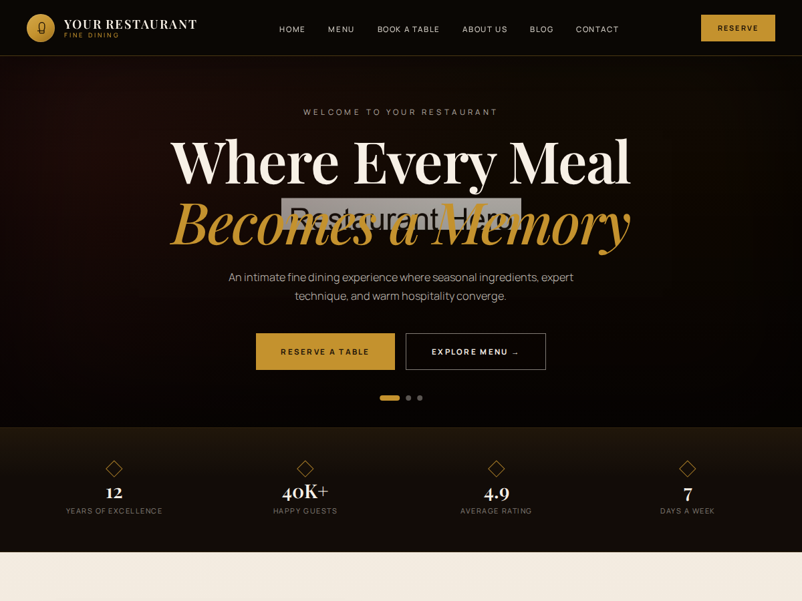

# DineCraft — Free WordPress Restaurant Theme

DineCraft is a **[WordPress restaurant theme free](https://www.createswowtech.com/themes/dinecraft-restaurant-wordpress-theme)** to download and use, built for venues that want their website to feel as considered as their menu. Fine dining rooms, cafés, steakhouses, sushi bars, bakeries, and hotel restaurants get a complete site with menu presentation, guest testimonials, a chef story, and table reservations — without hiring a designer or keeping a developer on retainer.

Released under the GPL, with no locked sections and no paid upgrade required.

**[Download the free WordPress restaurant theme →](https://www.createswowtech.com/themes/dinecraft-restaurant-wordpress-theme)**



## Contents

- [Why DineCraft](#why-dinecraft)
- [Who it is for](#who-it-is-for)
- [Templates included](#templates-included)
- [Features](#features)
- [Requirements](#requirements)
- [Installation](#installation)
- [Setup guide](#setup-guide)
- [Customizer settings](#customizer-settings)
- [Companion plugin](#companion-plugin)
- [Translation](#translation)
- [Development](#development)
- [FAQ](#faq)
- [License and credits](#license-and-credits)

## Why DineCraft

**Turns visitors into bookings.** Because bookings matter more than page views, the reservation template and repeated call-to-action sections keep table booking one click away from every page.

**Loads fast.** System font stacks with no remote font requests, explicit image dimensions, and optimized queries keep Core Web Vitals healthy and reduce layout shift.

**Respects guest privacy.** No third-party embeds and no tracking scripts. The location section uses a plain directions link rather than an embedded map iframe.

**Accessible by default.** A skip link, keyboard-friendly navigation, ARIA labels, and screen-reader text are built in.

**Safe to extend.** All output is escaped and all Customizer input is sanitized. The theme passes the Theme Check plugin with no reported issues.

**Easy to hand over.** Your client edits the restaurant name, hero copy, hours, contact details, and social links from the WordPress Customizer without touching code.

## Who it is for

Fine dining restaurants and luxury dining rooms, cafés, coffee shops, bakeries, bistros, brasseries, gastropubs, steakhouses, seafood and sushi restaurants, Italian and Indian restaurants, hotel and resort restaurants, bars, lounges, wine rooms, catering services, private chefs, and food businesses.

## Templates included

| Template | File | Purpose |
| --- | --- | --- |
| Front page | `front-page.php` | Rotating hero, story, signature dishes, reservation CTA, testimonials |
| Menu | `page-templates/template-menu.php` | Category filter pills and a chef's tasting menu band |
| Book a Table | `page-templates/template-book.php` | Reservation form layout, hours, large-group and cancellation info |
| About | `page-templates/template-about.php` | Story, philosophy, and team |
| Contact | `page-templates/template-contact.php` | Address, phone, email, and a directions link |
| Blog | `page-templates/template-blog.php` | Blog listing as an assignable page template |
| Blog index | `home.php`, `index.php`, `archive.php` | Posts page, fallback, and archives |
| Single post | `single.php`, `comments.php` | Post detail with threaded comments |
| Search and 404 | `search.php`, `404.php` | Search results and not-found pages |

## Features

- Free and GPL licensed, with no locked or paid-only sections
- Fully responsive layouts tested on phones, tablets, and desktops
- Table reservation page template ready for the form plugin of your choice
- Menu presentation with categories, pricing, descriptions, images, and badges
- Guest testimonials with star ratings
- Custom logo, custom header, and custom background support
- Block editor ready: wide alignment, responsive embeds, block styles, and editor styles
- Two block patterns: Reserve a Table CTA and Opening Hours Card
- Two block styles: Restaurant Card and Testimonial Quote
- Primary and footer navigation menus with an accessible fallback menu
- Blog sidebar and footer widget areas
- Threaded comments with avatars and comment pagination
- Translation ready with a bundled `dinecraft.pot` template
- Bundled placeholder images so the theme looks complete before you add content

## Requirements

- WordPress 6.0 or later (tested up to 6.9)
- PHP 7.4 or later

## Installation

### From the WordPress admin

1. Download the theme ZIP from the [DineCraft product page](https://www.createswowtech.com/themes/dinecraft-restaurant-wordpress-theme).
2. Go to **Appearance → Themes → Add New → Upload Theme**.
3. Choose the ZIP file and click **Install Now**.
4. Click **Activate**.

### Manually over FTP

1. Unzip the theme archive on your computer.
2. Upload the `dinecraft` folder to `/wp-content/themes/` on your server.
3. Go to **Appearance → Themes** and activate DineCraft.

### From this repository

```bash
cd wp-content/themes
git clone git@github.com:hiteshagrawal84/dinecraft.git
```

Keep the folder named `dinecraft` so the folder slug matches the text domain used for translations.

## Setup guide

1. Activate the optional DineCraft Core companion plugin to unlock banners, menu items, testimonials, reservations, and contact messages.
2. Create your pages: Menu, Book a Table, About, Contact, and Blog.
3. Assign the matching template to each page from **Page Attributes → Template** in the page editor.
4. Under **Settings → Reading**, set a static front page and choose your Blog page as the posts page.
5. Under **Appearance → Menus**, build your navigation and assign it to the Primary and Footer locations.
6. Under **Appearance → Customize → Restaurant Options**, fill in your restaurant details (see the table below).
7. Under **Appearance → Customize → Site Identity**, upload your logo, then set your imagery with the custom header and background options.
8. Add your dishes as menu items, group them with menu categories, and add guest testimonials.
9. Add a form block or shortcode to the Book and Contact pages so submissions are delivered.
10. Optional: add widgets to the Blog Sidebar and Footer Widgets areas under **Appearance → Widgets**.

## Customizer settings

All presentation settings live under **Appearance → Customize → Restaurant Options**.

| Setting | Description |
| --- | --- |
| Restaurant Name | Name shown in the header, hero, and footer |
| Restaurant Tagline | Short line beneath the name |
| Hero Title | Main headline on the front page hero |
| Hero Subtitle | Supporting line beneath the hero title |
| Footer Description | Short paragraph in the footer |
| Address, Phone, Email | Contact details used across the footer and contact page |
| Copyright Text | Footer credit line |
| Map Latitude, Map Longitude | Coordinates for the Get Directions link |
| Footer Credit URL | Optional link on the footer credit |
| Instagram, Facebook, X / Twitter | Social profile links |

## Companion plugin

DineCraft follows the WordPress theme review guideline that content and functionality belong in plugins, not themes. The optional **DineCraft Core** plugin registers the post types the templates display: banners, menu items, menu categories, testimonials, reservations, and contact messages.

The theme works without the plugin and falls back to bundled placeholder content. An admin notice points you to the plugin when it is not active. Keeping this content in a plugin means it survives if you ever switch themes.

Form processing is also plugin territory. Add a form block or shortcode from your preferred form plugin, or activate the companion plugin, to make the Book and Contact pages accept submissions.

## Translation

All strings use the `dinecraft` text domain. A `dinecraft.pot` template ships in `languages/`. Drop your `.po` and `.mo` files into the same folder, named for your locale, for example `dinecraft-fr_FR.mo`.

## Development

The theme is plain PHP, CSS, and vanilla JavaScript with no build step. Edit the files directly.

`screenshot-preview.html` is a static render of the homepage used to generate the theme screenshots. To regenerate them:

```bash
npm install
npm run screenshot
```

This writes `screenshot.png` (the 1200×900 theme thumbnail) and `screenshot-full.png` (a full-page capture).

## FAQ

**Is DineCraft really free?**
Yes. It is released under the GNU General Public License v2 or later. You can use it on client sites and commercial projects, and you can modify it.

**Does the theme process reservations or contact messages on its own?**
No. Form processing is plugin functionality under the WordPress.org Theme Directory guidelines. Use a form plugin or the companion plugin.

**Can I use it for a café, bakery, or bar instead of a fine dining restaurant?**
Yes. The layouts, menu presentation, and reservation flow suit any food and drink venue. Change the hero copy, colors, and imagery from the Customizer.

**Does it load Google Fonts or embed Google Maps?**
No. DineCraft uses system font stacks with no remote font requests, and links out for directions instead of embedding a map iframe.

**Where do I get support?**
Support and customization requests are handled at [CreatesWowtech](https://www.createswowtech.com).

## License and credits

DineCraft WordPress Theme, Copyright 2026 [CreatesWowtech](https://www.createswowtech.com). Distributed under the terms of the [GNU GPL v2 or later](https://www.gnu.org/licenses/gpl-2.0.html).

- Bundled placeholder images in `assets/images/placeholders/` — Copyright 2026 CreatesWowtech, GPL-2.0-or-later
- Inline SVG icons in `inc/icons.php` are derived from [Lucide](https://lucide.dev/) — Copyright (c) 2020 Lucide Contributors, ISC License

See [`readme.txt`](readme.txt) for the full changelog.

---

DineCraft is maintained by [CreatesWowtech](https://www.createswowtech.com). Get the latest release, live demo, and documentation on the [DineCraft free WordPress restaurant theme page](https://www.createswowtech.com/themes/dinecraft-restaurant-wordpress-theme).
